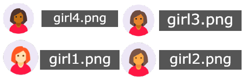
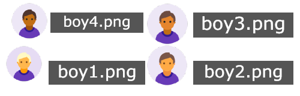
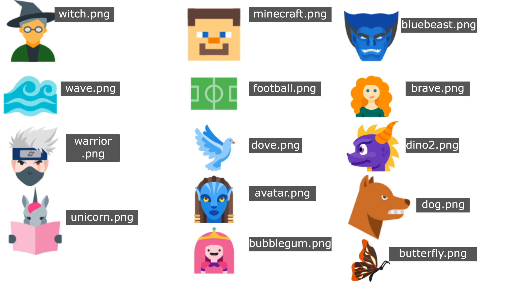
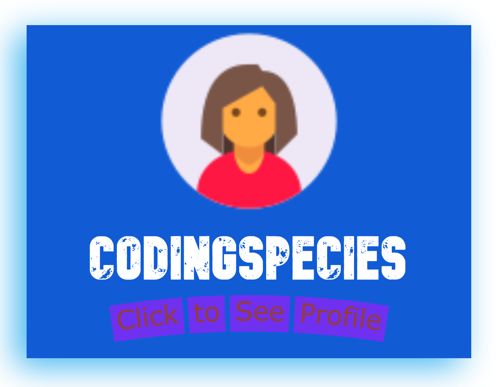

<div align=center>
    
    <h1> Social Motto </h1>
    <a href="https://github.com/App-Choreography/SocialMotto/issues">  </a> <a href="">  </a>
    <a href="https://github.com/App-Choreography/SocialMotto/pulls">  </a> <a href="https://github.com/App-Choreography">  </a>
</div>
<h3>
    <details close>
        <summary> 
            👉 Click to See how to make your own Social Motto 👈 
         </summary> 

<br>

> If you need help on mastering Markdown, see [👉 Here 👈](https://www.markdownguide.org/)

If your PR is successful, you will get the digital sticker designed personally for you!
### 🤞 Hopefully, this is what you shall get : 🤞


1. Fork 🍽️ this repo, by pressing the `fork` button at the top right of the screen.
2. `git clone` your forked version of the repo to your PC.
3. Now you have your own local copy, go to the `SocialProfiles` folder.
4. Make a file with your name as the file name:
**EG:**
`CodingSpecies.md`
5. Use this as your boilerplate code:

```html 

<div align=center>

  

    <h1> Name here </h1>
    <h4>💭 <b> Motto goes here 💭 </b> </h4>

    <br>

    
    <h3> Profession: Your job </h3>

    <br>

    
    <a href="website url"> <h3>Website: Your website name </h3> </a>

    <br>

    
    <h3> Favourite Emoji: Fave emoji

    <br>

    
    <h3> Favourite Code Language: fave code lang

</div> 

```
6. Copy the boilerplate into your file 📂.
7. Change it to your personal choices!
8. Now, go to the [SocialProfileList.md](./SocialProfileList.md) and add your file path as shown in the file.

### Pushing your changed the remote copy:

1. Go to your terminal/ git bash.
2. `cd` to the repo.
3. `git add -A` to add all of your changes.
4. `git commit -m "Added my profile."` to commit your changes.
5. `git push` to push all your changes successfully.

### Making A Pull Request: 
1. Go to your forked copy, and where it says `This branch is ___ commits ahead of App-Choreography:main.` it shows a contribute button.
2. From there open a pull request. As the title, say: `Add USERNAME.md`.
3. We will review and add our own `hacktoberfestPractice-Accepted` tag!

Now for the best part...

## Our rewards for you 🥇:

- [x] You will be added and given your own special link with your profile!
- [x] You will get an invite to our organisation! 🎖️
- [x] We will add you automatically to our Hall of Fame 🖼️!
</details>

[See all profiles](./SocialProfileList.md)

<details close>
    <summary>
        👉 Click to see the available icons and add-ons to customize your profile! 👈
    </summary>
    
    
    
    See the rest here: 
    <a href="./avatar">  Avatars </a>
</details>
</h3>


<a href ="">  </a>

# This is still in progress! Will be open to contributions soon!
